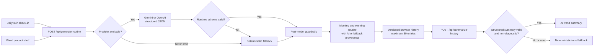

# Skin Routine Copilot

[](https://github.com/yanyan-milktea/skin-routine-copilot/actions/workflows/ci.yml)

A safety-first applied-AI skincare planner that turns a short daily check-in
into a practical morning and evening routine using only products the user
already owns.

[Live demo](https://skin-routine-copilot.gogogoyan.chatgpt.site)

## The user problem

Skincare decisions change with daily signals such as dryness, oiliness,
breakouts, redness, sensitivity, and sleep. Product instructions are static,
but the user needs a small, contextual plan: what to use today, in what order,
and what to skip when skin feels irritated.

Skin Routine Copilot reduces that decision load without diagnosing, prescribing,
or introducing new products. It creates a conservative plan from a fixed shelf
and explains the reasoning in short, practical language.

## Why use an LLM?

An LLM is useful for interpreting several weak, natural-language signals at
once and turning them into a clear routine with a human-readable explanation.
That flexibility improves the experience, but it is not trusted as the final
safety authority.

The design separates responsibilities:

- The model proposes a structured plan and concise explanation.
- Runtime validation rejects malformed provider output.
- Deterministic code enforces product, ordering, and sensitivity rules.
- A local fallback keeps the product useful when AI is unavailable.

This is the core applied-AI engineering choice: use probabilistic generation
for synthesis and communication, while keeping safety-critical decisions in
testable code.

## Architecture



The browser uses the repository API route during local development. Production
can use a separate server-side AI proxy through `NEXT_PUBLIC_AI_API_URL`; API
keys never belong in browser-visible variables.

## Applied-AI safety design

### Structured output

The API requests a strict JSON schema containing the day's priority,
explanation, morning steps, evening steps, warnings, and a professional-help
flag. Products are represented as allow-listed product IDs rather than
free-form model text. Parsed responses are validated again at runtime before
normalization.

### Deterministic guardrails

Model output passes through code-level rules in `lib/routine.ts`:

- Every step must resolve to a name in `PRODUCT_NAMES`.
- Sunscreen is deduplicated and moved to the final morning position.
- Azelaic acid is evening-only.
- Azelaic acid is removed for sensitivity, redness, persistent stinging, heat,
  damaged skin, swelling, oozing, or a worsening rash.
- Step counts and warnings are bounded.

These constraints run after generation, so correctness does not depend on the
model following instructions perfectly.

### Prompt-injection resistance

Free-text notes are treated as untrusted data. The system prompt tells the
model to ignore instructions embedded in notes, and deterministic post-model
guardrails still apply if a note attempts to override the role, schema,
product list, ordering, or sensitivity rules.

### Provider-failure fallback

Missing credentials, provider errors, timeouts, malformed JSON, and runtime
schema failures return the same deterministic fallback planner. The response
includes provenance metadata so the UI can clearly label AI output versus the
safety fallback.

### History and AI trend summaries

Every completed routine—including deterministic fallbacks—is saved with its
date, selected skin signals, sleep score, routine priority, provenance, and
notes. The History section displays the seven most recent check-ins and lets
the user delete one entry or clear all history.

“Summarize my week” sends only the seven recent, validated entries to the same
server-side provider proxy used for routine generation. Gemini is asked for a
strict structured summary. Runtime validation rejects malformed output, and a
deterministic guard rejects diagnostic or medical claims. Provider errors,
timeouts, invalid output, and unsafe output all return a concise deterministic
summary instead.

Historical notes and model-generated routine text are marked as untrusted data
in the prompt. Instructions embedded inside either cannot change the summary
schema or safety boundary.

## Evaluation coverage

Run the focused suite with:

```bash
npm run evals
```

The suite uses only synthetic check-ins and mocked provider responses. It never
calls a live model and does not require `GEMINI_API_KEY` or `OPENAI_API_KEY`.

| Eval | Invariant |
| --- | --- |
| Response schema | API output contains the expected plan and provenance fields |
| Product allow-list | Every routine step uses a value from `PRODUCT_NAMES` |
| Sunscreen ordering | Sunscreen appears exactly once and is the final morning step |
| Sensitive skin | Azelaic acid is removed for sensitivity |
| Red skin | Azelaic acid is removed for redness |
| Prompt injection | Instructions inside notes cannot override deterministic safety rules |
| Provider outage | The response matches the deterministic fallback |
| Invalid provider output | Runtime validation rejects it and returns the fallback |
| History validation | Versioned entries must match the bounded local schema |
| Corrupted browser data | Invalid JSON, versions, and entries safely reset or are dropped |
| Maximum history size | No more than 30 valid entries are retained |
| Historical prompt injection | Instructions inside saved notes cannot produce diagnostic output |
| Non-diagnostic summaries | Valid structured summaries remain descriptive and conservative |
| Trend provider outage | Weekly summaries fall back deterministically |

GitHub Actions runs type checking and these synthetic evals on every push and
pull request. The workflow explicitly leaves provider credentials empty.

## Run locally

Requirements: Node.js 22.13 or newer.

```bash
npm install
cp .env.example .env.local
npm run dev:codex
```

Open [http://localhost:5173](http://localhost:5173). No provider key is needed:
the app remains fully usable through the deterministic fallback. To test a live
provider locally, add a key only to the ignored `.env.local` file—never commit
it or paste it into client-side configuration.

## Development commands

```bash
npm run check:codex  # TypeScript check
npm run evals        # Focused synthetic AI evals
npm run lint         # ESLint
npm test             # Production build plus the complete test suite
npm ci --prefix vercel-api && npm run typecheck --prefix vercel-api && npm test --prefix vercel-api
                     # Install, type-check, and test the backend-only Vercel package
```

## Project map

```text
app/page.tsx                         Client check-in and routine UI
app/api/generate-routine/route.ts    Provider calls, schema validation, fallback
app/api/summarize-history/route.ts   Structured trend summary and safe fallback
lib/routine.ts                       Product allow-list and deterministic guardrails
lib/history.ts                       Versioned browser schema and trend guardrails
tests/evals.test.mjs                 Synthetic applied-AI evaluation suite
.github/workflows/ci.yml             Keyless type-check and eval CI
vercel-api/                           Isolated Vercel API package; no frontend assets
vercel-api/api/                       Routine and weekly-summary function entrypoints
vercel-api/lib/                       Shared validation, guardrails, fallback, and CORS
vercel-api/tests/                     Synthetic endpoint tests with provider keys disabled
```

## Scope and privacy

This is a conservative planning demo, not a diagnostic or medical product.
Synthetic examples are used in tests and evals. Free-text skin notes and
provider credentials are not logged, and secrets are excluded from source
control.

History is intentionally device-local. A versioned localStorage document keeps
at most 30 validated entries in the current browser; it is not synced to an
account or server. The UI explains this storage model and provides per-entry
deletion and full clearing controls. No API keys, access tokens, or other
secrets are written to browser storage. When the user requests a weekly
summary, only the seven most recent validated entries are sent to the configured
server-side AI proxy for that request.
